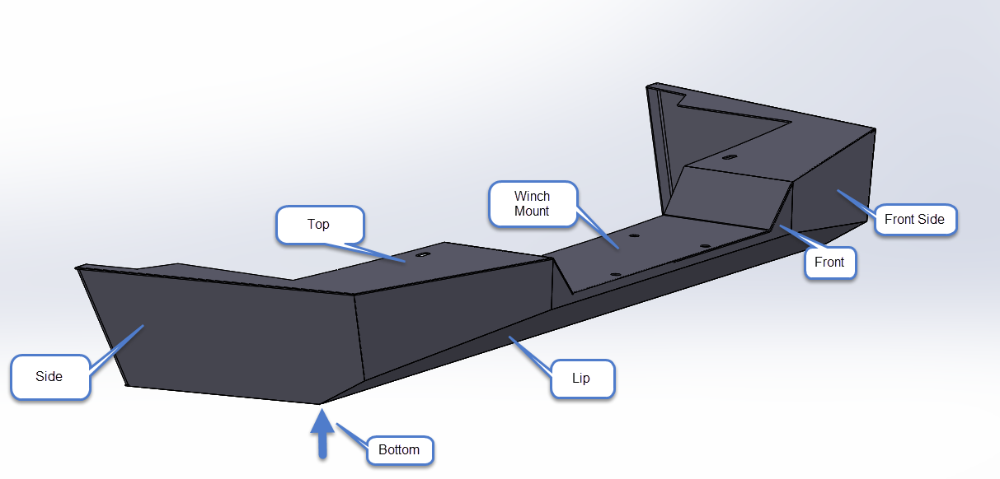

# OpenSourceXJ
Open Source XJ Project - DIY Accessories for the Jeep Cherokee XJ

## Front Bumper
DXF files to cut and weld a front winch bumper are located in the Front_Bumper folder.

This design has mounting holes for a standard 10" x 4.5" winch mounting pattern.
